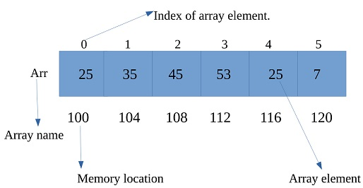
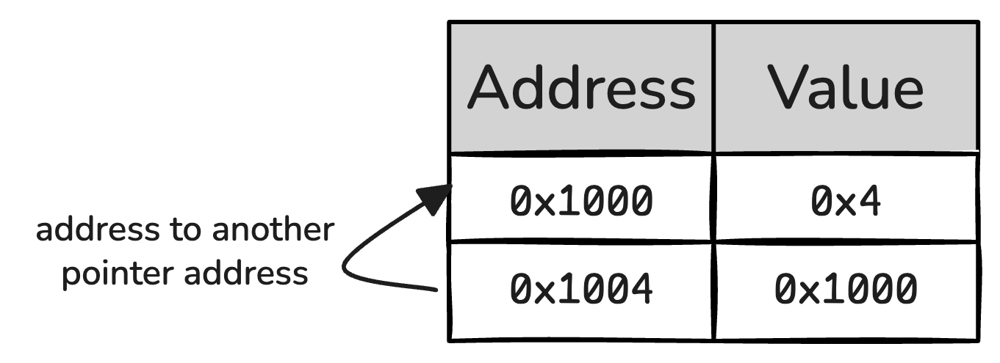
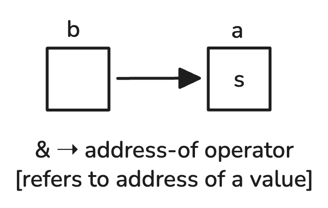
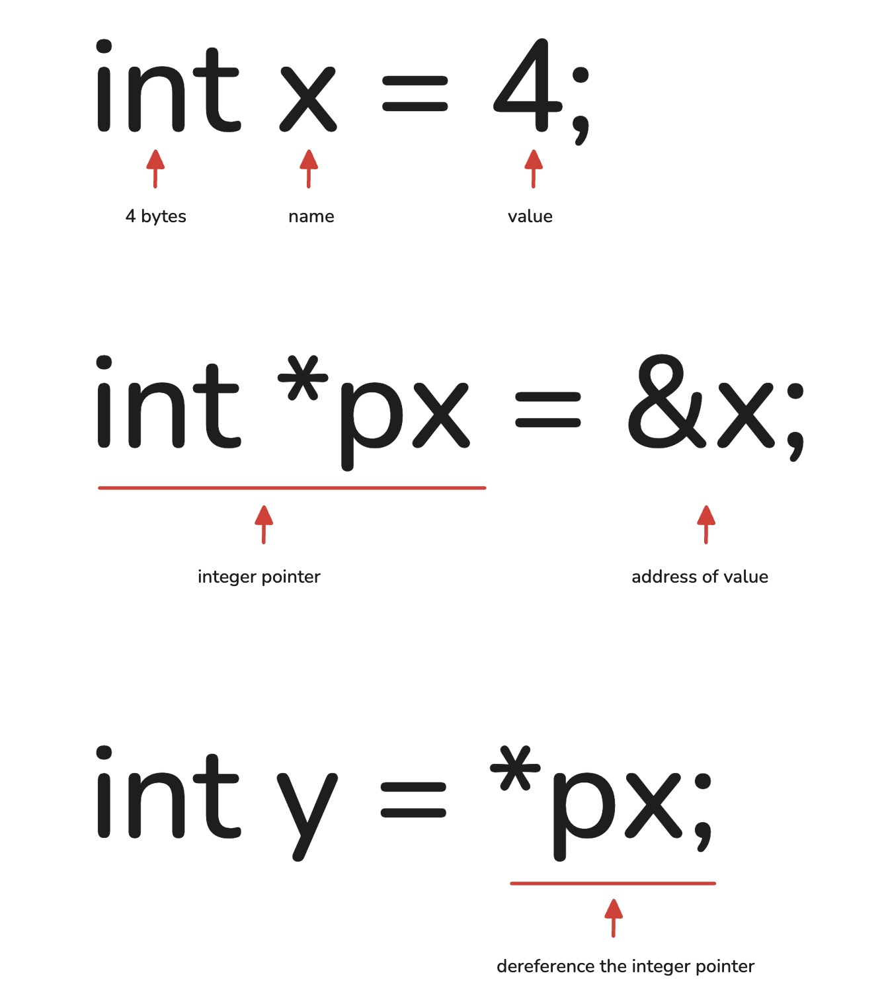

## Input and Output
```cpp
// take input and give output
cin >> variable;
cout << "Hello";
```
## Arrays
```cpp
// different ways to write arrays
int arr[5]; arr[0]=10;
int arr[5] = {1, 2, 3, 4, 5};
int arr[] = {1, 2, 3, 4, 5};
int arr[5] = {1, 2}; // rest are 0
```

> \- arrays are in contiguous memory <br>
> \- in arrays, `begin` &rarr; arr, `end` &rarr; arr + size

<p align="center">
    
<p>

## Low Level
### sizeof
- compile time operator returns size in bytes for datatype/variable
- size is determined at compile time
- returns the size in bytes(size_t)
  
```cpp
// example
sizeof(int) // 4 bytes of int
sizeof(arr) // 5 * 4 bytes = 20 bytes
sizeof(arr[0]) // 4 bytes
```
`sizeof(arr)/sizeof(arr[0])` &rarr; length of array

### size_t
```cpp
int arr[1000000]
sizeof(arr) // if returned in int, can overflow so we use size_t
int hex = 0xFF // (0-255 in hex)
int binary = 0b1010
```

### unsigned
- variables with `unsigned` can only be positive and 0
- if an unsigned value is given a negative number, then we wrap around, aka 
```cpp
            value = MAX_DATATYPE + (negative number)
```

```cpp
int x = -5; // unsigned
unsigned int x = 5; // signed
```

### Ranges
- we use char to denote 1 byte
- `char` &rarr; 1 byte
- `int` &rarr; 4 bytes
- 1 byte &rarr; 8 bits &rarr; 256 different values
- Bit cant be 0/1
```bash
# there is more range of numbers for unsigned
unsigned char # -128 to 127
unsigned char # 0 to 255
```

### Calculating Value
int = 4 bytes = 256<sup>4</sup> or 2<sup>4*8</sup>

256<sup>4</sup> &rarr; byte thinking

2<sup>4*8</sup> &rarr; bit thinking

`(bytes * bits)` &rarr; 4 * 8 = 32

For signed Range,

-2<sup>(n-1)</sup> to +2<sup>(n-1)</sup> - 1

### Datatypes
`char` &rarr; 1 byte

`short` &rarr; 2 bytes

`int` &rarr; 4 bytes

`long` &rarr; 4/8 bytes

`long long` &rarr; 8 bytes

`float` &rarr; 4 bytes (6-7 decimals)

`double` &rarr; 8 bytes (15-17 decimals)

`long double` &rarr; 12/16 bytes

`bool` &rarr; 1 byte

### Auto Rules
auto a = 5.0 &rarr; double

auto b = 5.0f &rarr; float

### Integer Literals
`int a = 10000000 * 1000000` &rarr; two large integers will lead to overflow!

we use integer literals to not have it overflow

```cpp
// examples
42, 42L, 42LL
42U, 42UL, 42ULL
```

`final` &rarr; cannot/prevents inheritance

`const` &rarr; value cannot change, can change where it points

## Headers and Key Functions
1. <u><b>#include\<iostream></b></u> &rarr; Input/Output Operations
    ```cpp
    cout << "Hello"
    cin >> variable;
    getline(cin, string);
    endl;
    ```

2. <u><b>#include\<algorithm></b></u> &rarr; Common algorithms and utils
   - <u><b>Search & Find</b></u> 
        ```cpp
        find(begin, end, value) // gives end iterate if not found
        count(begin, end, value)
        max-element(begin, end) // gives iterator 
        min-element(begin, end) // gives iterator
        ```

   - <u><b>Sort & Rearrange</b></u> 
        ```cpp
        sort(begin, end)
        swap(a, b)
        reverse(begin, end)
        ```

   - <u><b>Transformation</b></u> 
        ```cpp
        transform (begin, end, dest_begin, func)
        remove(begin, end, value) // DOESN'T delete, moves to back (returns new end iterator)
        replace (begin, end, oldval, newval)
        ```

   - <u><b>Mathematical</b></u> 
        ```cpp
        accumulate(begin, end, init) // init is start value
        fill(begin it, end it, value) // fill(arr, arr+5, 10) (Here, we have arr[5])
        reverse(begin, end)
        ```

3. <u><b>#include\<string></b></u> &rarr; String operations
    ```cpp
    string str = "Hello"
    str.size(), str.length()
    str.substr(start_pos, len) // start at pos, take len characters [*]
    str.find('text')
    str.erase(start_pos, len) // same as substr [*]
    str.replace(pos, len, "hello")
    string::npos // end position for string, it is in (size_t)
    ```
    
4. <u><b>#include\<cstring></b></u>
    ```cpp
    strlen(str)
    strcpy(dest, source)
    strcat(dest, source)
    strcmp(str1, str2) // returns 0 if identical
    memset(ptr, value, size in bytes) // only use for 0/-1 setting
    ```
    
5. <u><b>#include\<cmath></b></u> &rarr; Mathematical Functions
    ```cpp
    pow(base, exponent)
    sqrt(x)
    floor(x)
    ceil(x)
    abs(x)
    trunc(x) // rounds to 0 but in same type
    round(x) // rounds to nearest integer. (for 0.5 rounds upto 1, for -0.5 rounds downto -1)
    M_PI
    ```

6. <u><b>#include\<climits></b></u> &rarr; Integer and Other Limits
    ```cpp
    INT_MIN
    INT_MAX
    LONG_MAX
    CHAR_MAX
    RAND_MAX = 32k~
    ```

7. <u><b>#include\<ctype></b></u> &rarr; Character Classification and Conversion
    ```cpp
    isalnum(c)
    isalpha(c)
    isdigit(c)
    islower(c)
    isupper(c)
    tolower(c) // [*]
    toupper(c) // [*]
    ```

8. <u><b>#include\<cstdlib></b></u>
    ```cpp
    stoi(string) // string to int
    stof(string) // string to float
    stod(string) // string to double
    stoll(string) // string to long long
    to_string(number)
    rand() // a number between 0 and RAND_MAX
    srand(seed)
    ```
9.  <u><b>#define</b></u>
    ```cpp
    #DEFINE PI 3.14159
    ```

## Pointers
> \- memory has an address and value <br>
> \- address is the location of memory <br>
> \- value is the data stored

<p align="center">
    
<p>

<u><b>Pointer</b></u> - A pointer is a value thats an address <br>
<u><b>Reference</u></b> - Allows us to refer to some area of menony
```cpp
int a = 5
int b = &b
// both point to same memory
// can refer to same value with a, b
// no data is copied and instead is passed
```

<p align="center">
    
    
<p>

```cpp
int x = 4;
int *px = &x;
int y = *px;
```

```cpp
// learn
int ≠ int*
int *y ≠ *y
int *y //integer pointer
     y // address of x
    *y // dereference y and get value at x
```

## Pointers Example
<u><b>Pass by Value</u></b> <br>
```cpp
// a is a copy, hence x is not changed
int x = 10;
void work (int a) {
    a = 11;
}
work(x)
```

<u><b>Pass by Reference</u></b> <br>
```cpp
// a is a reference of x, so we are modifying x
int x = 10;
void work (int &a) {
    a = 11;
}
work(x)
```
 
<u><b>Pass by Pointer</u></b> <br>
```cpp
// pointer of x is passed and we change it through that
int x = 10;
void work (int *a) {
    *a = 11;
}
work(&x)
```

## Errors
1. <u><b>Compile Time Error</b></u>
   - code doesn't compile
   - read compiler messages
   - check syntax, headers, variable declaration

2. <u><b>Run Time Error (RTE)</b></u>
   - code compiles but crashes during runtime/execution
   - <u><b>Types</u></b>
     1. <b>Segmentation Fault</b> &rarr; out of bound access
     2. <b>Division by zero</b>
     3. <b>Stack overflow</b> &rarr; example: infinite recursion (too many func calls)

3. <u><b>Time Limit Exceeded (TLE)</b></u>
   - code is too slow and exceeds time limit
   - infinite loops
   - too large loops

4. <u><b>Memory Limit Exceeded (MLE)</b></u>
   - program is using too much memory
   - <u><b>Types</b></u>
     1. <b>Large Aways</b>
     2. <b>Memory leaks</b> &rarr; never deleting used data stauctures

5. <u><b>Overflow Errors</b></u>
   1. <b>Integer Overflow</b>
   2. <b>Buffer Overflow</b>
        ```cpp
        // buffer overflow example
        int arr[5];
        arr[5] = 10;
        ```

## Compile Time and Run Time
<u><b>Compile Time</u></b> <br>
- reads code top to bottom
- if it encounters some variable it doesn't know/has wrong syntax, it gives error

### <u>Uses</u>
<table>
<tr>
    <th>Compile Time</th>
    <th>Run Time</th>
</tr>
<tr>
    <td>1. variables not in scope</td>
    <td>1. variable has garbage valve</td>
</tr>
<tr>
    <td>2. function used but not declared</td>
    <td>2. array declared but not initialized</td>
</tr>
<tr>
    <td>3. syntax errors</td>
    <td>3. logical errors in order</td>
</tr>
<tr>
    <td>4. type mismatches</td>
    <td></td>
</tr>
</table>

```cpp
// example
class MyClass {
    int b;
    int a;
public:
    MyClass() : a(5), b(a+10) // compiles fine
}

// here b is declaved before a, so 'a' uses garbage value for initializing 'a"
```
