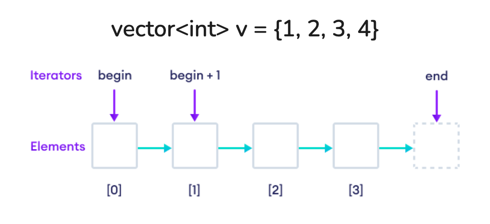

## Algorithms
1. Two Pointers 

2. Sliding Window

3. Binary Search

4. Priority Queue (top ki elements)

5. Hash Tables

6. Heaps

7. Linked Lists

8. Binary Search Trees

9. Binary Trees

10. BFS

11. DFS

12. Backtracking/Recusion

13. Dynamic Programming

### <u><b>Other</u></b>
```
Graph
Divide & Conquer
Bitwise Manipulation
Trie
Fast & Slow Pointers
```

## STL Library (Data Structures)
1. `vector<T>`

2. `deque<T>` &rarr; double ended queue

3. `list<T>` &rarr; doubly linked list

4. `set<T>, multiset<T>` &rarr; header is <set>

5. `map<K, V>, multimap<K, V>` &rarr; header is <map>

6. `unordered_set<T>`

7. `unordered_map<K, V>`

8. `stack<T>` &rarr; FILO

9.  `queue<T>` &rarr; FIFO

10. `priority_queue<T>` &rarr; max heap is default

11. `pair<T1, T2>` &rarr; header is <utility>

12. `tuple<T1, T2, T3,..>` &rarr; header is <tuple>

### Other Data Structures
`set` &rarr; unique, sorted

`multiset` &rarr; duplicates, sorted

`map` &rarr; unique keys, sorted by keys

`multimap` &rarr; allows duplicate keys

`[]` &rarr; vector, array, map, unordered_map, deque <br>
`.find()` &rarr; string, map, set, multiset, multimap

## Common Operations
<u><b>vectors</b></u> <br>
```cpp
v.push_back(x)
v.pop_back()
v.size()
v.insert()
v.erase(begin, end+1) // aka it doesnt delete final element like `.end()` traversal
v. clear()
```

<p align="center">
    
</p>

<u><b>deque</u></b> <br>
```cpp
dq.push_front(x)
dq.pop_front()
```

<u><b>set</u></b> <br>
```cpp
s.insert(x) // no push for set
s.erase(begin, end+1)
s.find(4)
s.count(5)
```

<u><b>stack, pq</u></b> <br>
```cpp
st.push(x)
st.pop() // returns element
st.top()
st.empty()
st.size()
```

<u><b>queue</u></b> <br>
```cpp
q.push(x)
q.front()
q.back()
q.pop()
```

## STL Examples
<u><b>Vectors</u></b> <br>
```cpp
vector<int> v1;
vector<int> v2(5) // [0, 0, 0, 0, 0]
vector<int> v3(5, 10) // [10, 10, 10, 10, 10]
vector<int> v4 = {1, 2, 3, 4, 5}
vector<int> v6(v4) // copy of v4
vector<int> v7 = v4 // copy of v4
```

<u><b>Maps</b></u>
```cpp
map<string, int> m;
map<string, int> m = { {"test", 1}, {"4", 3} };
m.insert({"orange", 7}) // [*] 
m["orange"] = 7; // (preferred) [*]
m["orange"]++; // increments

// get keys with m[i].first
// get values with m[i].second
```

<u><b>Priority Queue</b></u> <br>
default is Max on Top(Max Heap)

<u><b>Min Heap</b></u> <br>
```cpp
priority_queue<int, vector<int>, greater<int>> min_pq;
```

<u><b>Pair<T1, T2></b></u> <br>
```cpp
#include<utility>
pair<int, string> p = {1, "apple"}, make_pair(3, "orange")
// p.first, p.second
```

<u><b>Tuple<T1, T2, T3, ...></b></u> <br>
```cpp
#include<tuple>
tuple<int, string, double> t = {1, "hello", 3.14};
get<0>(t) = 2;
get<1>(t) = "world";
```

## Iterators
objects that point to elements
```cpp
vector<int> v = {1, 2, 3, 4, 5};
vector<int>:iterator it = v.begin(); // creating an iterator
auto it = v.begin(); // creating an iterator
cout << *it // dereference iterator

// it[1], it::, it+2
// r.begin() , r.end()
// .rbegin(), .rend()
```

## Iterator Loops
```cpp
// 1
for(vector<int>::iterator it=v.begin();it!=v.end();it++){
    cout << *it;
}

// 2
for(auto element:v){
    cout << element;
}

// map 
// 3
for(auto [key, value]:m){
    cout << key << ":" << value;
}

// 4
for(auto it=m.begin(); m.begin()!=m.end(); it++){
    cout << (*it).first << ":" << (*it).second; // print iterator value
    cout << it->first << ":" << it->second; // print iterator value
}
```

## Strings
```cpp
string s = "Hello";
s[0], s.at(1), s.front(), s.back(), s.append("smthing")
string:npos // end position for string, it is in (size_t)
// 'a'=97 and 'z'=122
// 'A'=65 and 'Z'=90
```

### String Functions
```cpp
str.erase(pos, len)
str.find(value)
str.find(value, start_pos)
str.replace(pos, len, value)
str.substr(pos,len)
```

## Time Complexity
1. <b>Big Oh Notation ○</b> &rarr; at worst (Upper bound) (worst case )
2. <b>Big Omega Notation Ω</b> &rarr; at least (Lower bound) (best case)
3. <b>Big Theta Notation Θ</b> &rarr; exactly (Upper & Lower) (Average)

>  O(1) < O(log n) < O(n) < O(n log n) < O(n<sup>2</sup>) < O(n<sup>3</sup>) < O(2<sup>n</sup>) < O(n!)

### Basic Complexities
<table>
<tr>
    <th>Range</th>
    <th>Complexities</th>
    <th>Algorithms</th>
</tr>
<tr>
    <td>n < 20</td>
    <td>2<sup>n</sup>, n!</td>
    <td>Bruteforce, Backtracking</td>
</tr>
<tr>
    <td>n < 3000</td>
    <td>n<sup>2</sup></td>
    <td>Dynamic Programming</td>
</tr>
<tr>
    <td>3000 < n < 10<sup>6</sup></td>
    <td>n, n log n</td>
    <td>Two-Pointers, Greedy, Heap, Sort</td>
</tr>
<tr>
    <td>n > 10<sup>6</sup></td>
    <td>log n, 1</td>
    <td>Binary Search, Math</td>
</tr>
</table>

### Detailed Complexities
<table>
<tr>
    <th>Time Complexity</th>
    <th>Range</th>
    <th>Algorithms</th>
</tr>
<tr>
    <td>O(n!)</td>
    <td>n ≤ 12</td>
    <td>Permutations, Backtracking</td>
</tr>
<tr>
    <td>O(2<sup>n</sup>)</td>
    <td>n ≤ 20</td>
    <td>Memoization</td>
</tr>
<tr>
    <td>O(n<sup>2</sup>)</td>
    <td>n ≤ 3000</td>
    <td>Nested Loops</td>
</tr>
<tr>
    <td>O(n log n)</td>
    <td>n ≤ 10<sup>6</sup></td>
    <td>Sorting, Heap</td>
</tr>
<tr>
    <td>O(n)</td>
    <td>n ≤ 10<sup>6</sup></td>
    <td>Stack, Tree/Graph, 2-Pointer, Linked List, Array</td>
</tr>
<tr>
    <td>O(log n)</td>
    <td>n > 10<sup>8</sup></td>
    <td>Binary Search, Balanced Binary Tree</td>
</tr>
<tr>
    <td>O(1)</td>
    <td>n > 10<sup>9</sup></td>
    <td>Hashmap, Array access, Push/Pop, Math</td>
</tr>
</table>
