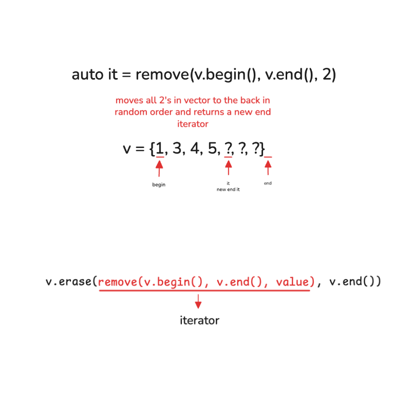

## Important Methods
1. <u><b>find() vs .find()</b></u> <br>
   <b>find() from \<algorithm></b>
   ```cpp
   // returns iterator/pointer
   // need to dereference with * iterator
   find(begin, end, value)
   ```

   <b>.find() method (strings, maps, set)</b>
    ```cpp
    .find(value) // returns position/index
    text.find('Hello') // 0
    text.find ('Hello', 1) // starts from index 1
    string::npos // end position for string, it is in (size_t)
    ```

    `.find()` is for map, string, set, multi-x

    `.find()` is NOT for vector, array, list, deque

2. <u><b>Transform</u></b> <br>
   perform some operation we define, we must give beginning of where to store
   ```cpp
   transform(s.begin(), s.end(), s.begin(),:: toupper);
   ```

3. <u><b>Remove and Erase</u></b> <br>
   <u><b>Remove</u></b> &rarr; does not delete elements but actually just gives new iterators to end
    ```cpp
    // example: vector<int> v = {1, 2, 3, 2, 4, 2, 5}
    auto it = remove(v.begin(), v.end(), 2)
    // r = {1, 3, 4, 5, ?, ?, ?}
    ```
    
    <u><b>remove-erase idiom</u></b> [*]
    ```cpp
    v.erase(remove(v.begin(), v.end(), value), v.end())
    ```

4. <u><b>rand()</u></b> <br>
    <u><b>Range</u></b> &rarr; 0 to N-1
    ```cpp
    rand() % N
    ```

    <u><b>Range</u></b> &rarr; 1 to N
    ```cpp
    rand() % N+1
    ```

5. <u><b>fill and memset</u></b> <br>
    ```cpp
    memset(arr, O, sizeof(arr))
    fill(arr, arr+100, 5)
    fill(v.begin(), v.end(), 5)
    ```

6. <u><b>sorting</b></u> <br>
    ```cpp
    sort(v.begin(), v.end(), greater<int>()); // remember its function here
    // [] can be used to access outside variables
    sort(v.begin(), v.end(), [] (int a, int b) {
        return a>b;
    });
    ```

7.  <u><b>Lambda Funtion</b></u> <br>
    ```cpp
    [capture] (parameters) {
        return x;
    }
    ```
    <u><b>pq</b></u> &rarr; priority-queue<int, vector<ints>, greater<int>> min_pq;

## Remove, Erase, Find, Replace, Insert
```cpp
remove(begin it, end it, value)
v.erase(begin it, end it)
v.erase(it) // single element
find(begin it, end it, value) // returns iterator 
replace(begin it, end it, oldval, newval)
v.insert(pos, val)
v.insert(pos, count, val)
v.insert(pos, first it, second it)
```
<p align="center">
    
<p>