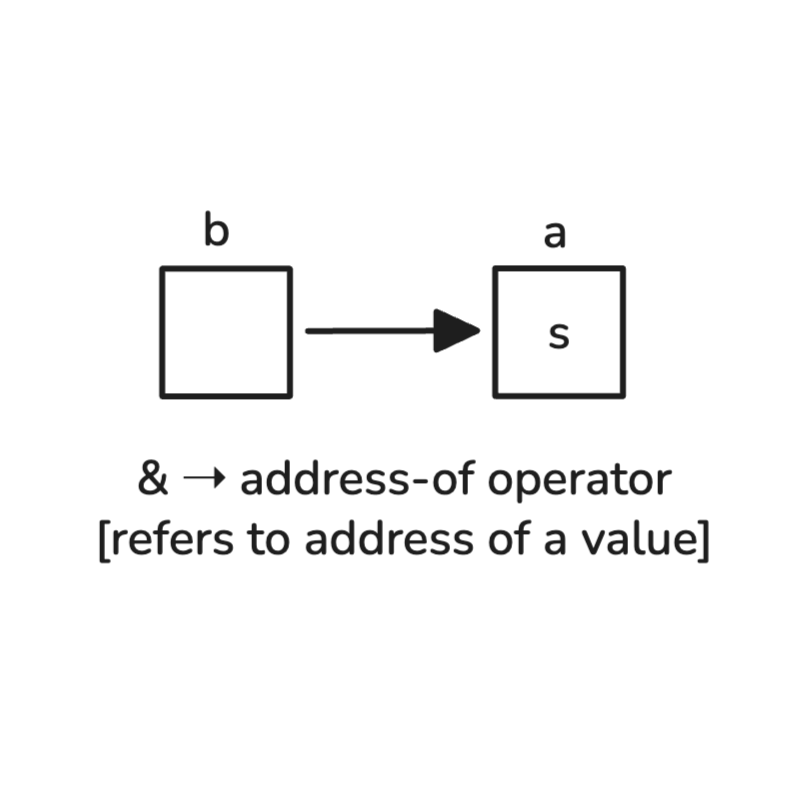
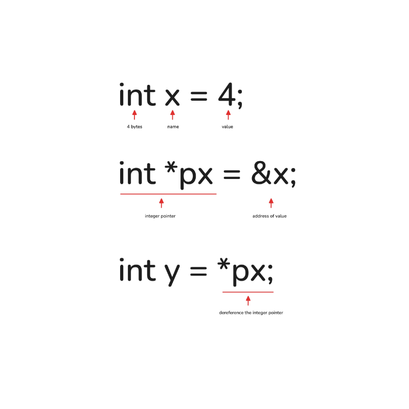

## Main
You can find most of the supported syntax [here](https://docs.github.com/en/get-started/writing-on-github/getting-started-with-writing-and-formatting-on-github/basic-writing-and-formatting-syntax)

everything else is written in the [PDF](github-md.pdf)

## Superscript and Subscript
hello <sub>there</sub> &rarr; Subscript

256 <sup>4</sup> &rarr; Superscript

> all same line images must be at 500px square
```html
<!-- same line images -->
<p align="center">
    <a href="#">
        
         
    </a>
</p>
```