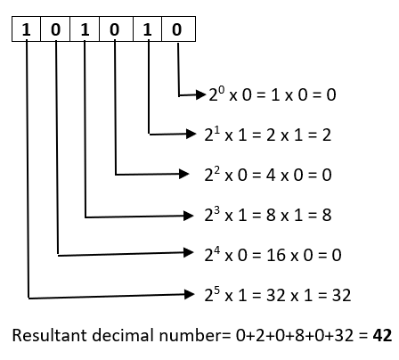
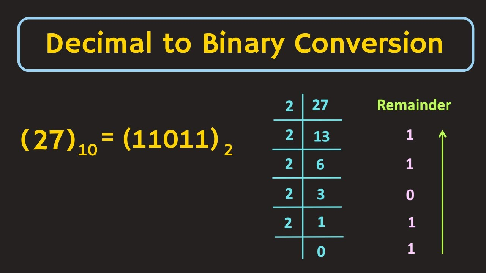

## 1. Computers & Hardware
Hardware and Software is present as the core foundation in Computer Science. We also have Memory which is Volatile and Temporary. We have storage in the form of RAM, SSD, HDD. Cache is very fast storage.

CPU (Central Processing Unit) does all the computation. It consists of Cores for Parallel Computation and each core contains multiple Threads. Architectures in CPU include ARM, x86. Each CPU has a speed it can compute at called Clock Speed.

GPU (Graphical Processing Unit) can be integrated into a CPU or exist as a separate Hardware. It uses SIMD (Single Instruction Multiple Data) for processing more efficiently (like matrices)

### Server
It is a computer that takes requests from client. No difference from normal computer. Some server may have specialized Hardware.

## 2. Operating Systems
OS is Software that runs on a Computer's Hardware. It is a abstraction layer above the Hardware. It allows us to build Software for that OS in a easier way.

There are 3 main Operating Systems &rarr; MacOS, Windows, Linux/Unix

MaxOs is also a Unix sytem but they have built alot of custom architecture on top of it so it is considered a different OS.

> Windows &rarr; For a Unix Terminal, you can use Ubuntu on WSL

## 3. Types of Software
Software can be deployed on Desktop, Internet, Mobile

`Desktop` &rarr; We can run via an executable. We have to worry about specific OS and CPU architecture since software is compiled for that specific platform

`VM Desktop Software` &rarr; The software is run in an environment like Java. It adds a layer of abstraction

`Mobile` &rarr; Mobile software is developed for iOS or Android

`Hybrid` &rarr; Software is created on a single Web Application but we can allow it to be accessed through multiple platforms. An example is a Desktop App is actually running a window of a Web Application.

## 4. Types of Languages
`Low-Level` &rarr; Closer to Hardware, High Performance, but hard to Program in

`High-Level` &rarr; More Abstractions, Easier to Write, Slower in Speed

`Assembly` &rarr; Lowest Low Level Programming Language available

`C` &rarr; Lowest Programming Language representing modern programming language

`C++` &rarr; Introduced OOPS, Templates, Exception Handling

`Java` &rarr; VM, Isolating Code Execution

`JS` &rarr; Similar to JVM, JS uses VM to execute code on browser

`Python` &rarr; High-Level language. Least syntax friction

### Compiled vs Interpreted Languages
`Compiled Language` &rarr; These languages have a `Compilation Step` and then execute code

`Interpreted Language` &rarr; These languages are read and executed at the same time. they may not catch syntax errors until code is executed `(Eg: Python)`

`General Rule` &rarr; Compiled Languages execute faster and have less runtime problems. They work slower though as it needs to recompiled for new changes. While Interpreters interpret as code is executed

`Source Code` &rarr; All written code is called Source Code

### Intermediate Language
Languages that run within a VM

### Managed Language
C#, java are hybrids which are first compiled into a intermediate language like Java Bytecode. It is not visible to us. This intermediate language acts as an in-between language for High-Level and Low-Level Machine Code. Intermediate Languages is **JIT Compiled**, meaning it is compiled on the fly as intermediate language is executed within a VM

### Transpiled Language
Some languages are translated to another language. Typescript is an example of a Transpiled Language as it is translated into Javascript. These languages are also called Source to Source Translator

### Declarative & Imperitive Language
`Declarative` &rarr; They focus on what to do (SQL)

`Imperitive` &rarr; They focus on how to do it (Programming Languages)

```js
// sql
// same command for all DBs but the query execution behind-the-scenes is different
SELECT * FROM user;

// programming language
// you tell each step individually
for user in users:
    print(user)
```

## 5. Binary
`Binary` &rarr; Number sytem of Base 2 **[0, 1]**

`Decimal` &rarr; Number sytem of Base 10 **[0, 1, 2, 3, 4, 5, 6, 7, 8, 9]**

Every place in Decimal is called Digit. Similarly, in Binary it is called a Bit

**Prefix** &rarr; it is usually written as `0b10110` or (10110)<sub>2</sub>

<p align="center"> 
    
    
</p>

### Data Types
All data types are typed in code. We need to know the type a particular binary represents. An example of this is `0b0100001` can be `A` or `65`

## 6. Bytes & Fractions
Computers work in groups of bits like 8, 16, 32, 64. Byte is the standard (8 bits)

<table>
  <thead>
    <tr>
      <th>Type</th>
      <th>In Bits</th>
    </tr>
  </thead>
  <tbody>
    <tr>
      <td>1 bit</td>
      <td>1 bit</td>
    </tr>
    <tr>
      <td>1 byte</td>
      <td>8 bits</td>
    </tr>
    <tr>
      <td>4 byte</td>
      <td>32 bits</td>
    </tr>
    <tr>
      <td>8 byte</td>
      <td>64 bits</td>
    </tr>
    <tr>
      <td>1 Kilobyte (KB)</td>
      <td>1024 bytes</td>
    </tr>
    <tr>
      <td>1 Megabyte (MB)</td>
      <td>1024 KBs</td>
    </tr>
    <tr>
      <td>1 Gigabyte (GB)</td>
      <td>1024 MBs</td>
    </tr>
    <tr>
      <td>1 Terabyte (TB)</td>
      <td>1024 GBs</td>
    </tr>
    <tr>
      <td>1 Petabyte (PB)</td>
      <td>1024 TBs</td>
    </tr>
    <tr>
      <td>1 Exabyte (EB)</td>
      <td>1024 PBs</td>
    </tr>
  </tbody>
</table>

### Fraction Numbers
numbers less than 1 are fraction numnbers

fractional numbers have 2 main limitations (Base 2 and Limited Precision)

float is 32 bit, double is 64 bit

some numbers cannot be represented perfectly like (1/10 in Binary, 1/3 in Decimal)

### Special Number
`Infinity, -Infinity` &rarr; max or min values

`Nan` &rarr; not a number is a floating number

## 7. Hex & Octal
`Octal` &rarr; Number sytem of Base 8 **[0, 1, 2, 3, 4, 5, 6, 7]**

`Hex` &rarr; Number sytem of Base 16 **[0, 1, 2, 3, 4, 5, 6, 7, 8, 9, A, B, C, D, E, F]**

hex is represented with `0x20AE` and octal is represented with `0o251`

hex is written in 4 bits and octal is written in 3 bits

## 8. Errors
Errors that show up on code execution are called bugs. We must keep track of the bugs that are found as we may not solve them right away due to severity

### Syntax Error
Syntax Error is code that is syntactically incorrect. Compilers always catch syntax error. We can use a linter to highlight syntax errors to catch them before them before compiling/executing code

### Compilation Errors
These errors exist only in Compiled Languages. It reduces issues at runtime. Interpreted Languages can figure out syntax error but are less effective

### Warnings
Warnings are not compilation errors, they are syntactically correct. Warnings arise when something is done in a suboptimal way. Being stricter is generally better here

### Runtime Errors
Runtime Errors are any Errors that lead to the Program crashing. We must avoid them as much as possible. They are also known as **Exceptions** and handled in code. An example would be reading a String value for an Integer

## 9. Debugging
### Logic Errors
In Logic Errors, the output we get is not as expected, but the code compiles and doesn't crash. The cause is not always a 100% clean. We can reduce these errors by writing clean, maintainable code. 

To fix bugs like this, we must **isolate the bug and environment of system**. If the user can get the bug, but cannot be recreated by us, it indicates an issue with the environment

### Isolate Bug
We can also shrink the area of code that needs to be checked by using print statements, debuggers,etc... We can also isolate it by reading the errors properly, using AI or programming communities and trying to understand it with depth.

## 10. Security & Software Testing
Software Testing is done to reduce bugs and check Security. Software Testing is used to test against bad input.

 There is also a need to know the basics of Cyber Security. Software Security is necessary to prevent  against SQL Injections, XSS, etc...

 ### White & Black Box Testing
 `Black Box Testing` &rarr; User testing is performed without knowing the internals of the syste,

 `White Box Testing` &rarr; Testers are aware of how internal systems work and use that knowledge

 ### Automated Testing
 Manual Testing can cause regressions. This means that the test would need to be updated frequently due to changes in how the code works.

 Regression testing is needed but automating it saves alot time while also writing testcases for bugs.

 ### Test Driven Development (TDD)
 In TDD, we write the testcases before the code is ever implemented. We then implement our code around these testcase to make sure that the code performs its intended function properly. This can lead to slower prototyping. It is also a Functionality First Approach

 ### Unit Tests & Integration Tests
 `Unit Tests` &rarr; They are small and used to test a single function. They are also used for only certain inputs to test things in isolation without other services

 `Integration Tests` &rarr; They are used to test end to end Systems by checking the Input and Output of each component and how it integrates

 `Bug Bounties` &rarr; Companie pay people who find critical bugs in their infrastructure

 ### Deployment Pipelines (DevOps & CI/CD)
 These Pipelines are used to bring software into production automatically after all testcases have passed. They are also used to push to new servers easily and redeploy different versions of a software. Having a Web Application reduces the stress of different versions as everyone has the same version

### Common Security Problems
- `Security Vulnerabilities in Libraries`
- `CORS` &rarr; different domain/origin request
- `XSS` &rarr; executing harmful scripts on users from our website
- `DDOS` &rarr; sending a ton of requests to overload website. can be fixed by using rate limiting
- `SQL Injection` &rarr; SQL Queries are executed which change the data. can be fixed using Prepared Statements
- `CSRF` &rarr; stealing cookies from my website when visiting another malicious website
- `Local Threats` &rarr; These include keyloggers, trojans, etc... For production systems, only the server must have access to the production database to reduce threats
- `2FA and other Security`

Try to break the application after creating it using these problems